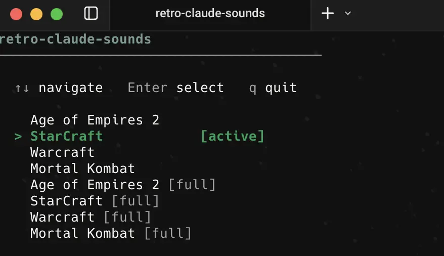
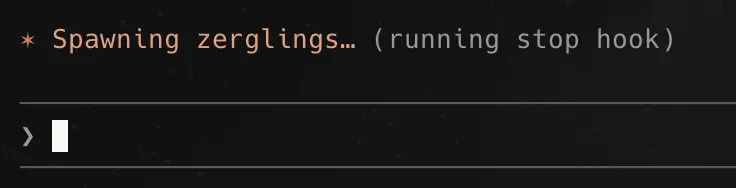

# retro-claude-sounds

[](https://opensource.org/licenses/MIT)

Retro game sounds for Claude Code hooks. Plays nostalgic sound effects on tool calls, submits, and session events.


## Installation

```bash
git clone https://github.com/sametacar/retro-claude-sounds
cd retro-claude-sounds
./install.sh
source ~/.zshrc
retro-claude-sounds
```

## Available Themes

| Theme | Game |
|-------|------|
| `ao2` | 🏰 Age of Empires 2 |
| `sc`  | 🚀 StarCraft |
| `wc`  | 🪓 Warcraft |
| `mk`  | 🕺 Mortal Kombat |

## Switch Themes

Open the interactive menu to switch themes:

```bash
retro-claude-sounds
```

Use `↑↓` to navigate, `Enter` to select, `q` to quit. The active theme is highlighted.



Alternatively, use aliases directly:

```bash
sounds-mk    # Mortal Kombat
sounds-sc    # StarCraft
sounds-wc    # Warcraft
sounds-ao2   # Age of Empires 2 (Turkish only)
```

Add `-full` to include submit sounds (plays on every message you send):

```bash
sounds-mk-full
sounds-sc-full
sounds-wc-full
sounds-ao2-full
```

## Themed Spinner Verbs

Each theme replaces Claude Code's default spinner verbs with game-themed phrases. When Claude is thinking, you'll see lines like *"Spawning zerglings"* or *"Summoning ogres"* instead of the defaults.

 

## How It Works

`install.sh` copies files to `~/.claude/` and adds theme aliases to `.zshrc`. Claude Code hooks trigger `play.sh` on the following events:

- `sessionstart` — when a session begins
- `sessionend` — when a session ends
- `stop` — when Claude finishes a response
- `question` — when Claude asks a question
- `submit` — when a message is sent *(only in `-full` variants)*

## Requirements

- macOS
- Claude Code
